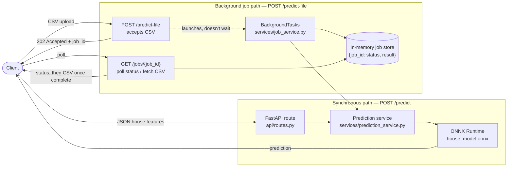

# California House Price Prediction API

A solo practice project exploring production-style ML-serving patterns: a FastAPI
service that predicts California house prices with a `RandomForestRegressor`
trained on the California Housing dataset, served through ONNX Runtime. It's not
built for a team or for scale — it's a sandbox for trying out the patterns a
real ML-serving system tends to need (modular structure, containerization, CI,
a faster inference runtime, non-blocking file processing, and structured logging)
one at a time.

## Request Flow



The `/predict` path is a normal request/response round trip. The `/predict-file`
path returns immediately with a `job_id`; the CSV is processed afterward by a
`BackgroundTasks` callback, and the client polls `GET /jobs/{job_id}` for status
and, once complete, the result CSV.

## Project Structure

```text
.
├── main.py                      # creates the app, wires logging + exception handlers + router
├── logging_config.py            # Loguru sink configuration (stderr + rotating file)
├── train.py                     # trains the RandomForestRegressor, saves joblib artifacts
├── convert_to_onnx.py           # converts house_model.joblib -> house_model.onnx
├── benchmark_latency.py         # sklearn vs ONNX inference latency benchmark
├── explore.py                   # dataset exploration scratch script
├── requirements.txt             # serving deps (fastapi, onnxruntime, pandas, ...)
├── requirements-train.txt       # training/conversion-only deps (scikit-learn, skl2onnx)
├── Dockerfile
├── .dockerignore
├── schemas/
│   └── house.py                 # HouseFeatures, PredictionResponse (Pydantic models)
├── services/
│   ├── prediction_service.py    # model loading + inference (no HTTP concerns)
│   └── job_service.py           # in-memory background job store + runner
├── api/
│   ├── routes.py                # thin route handlers
│   ├── middleware.py            # request logging
│   └── exception_handlers.py    # validation logging + generic 500 handler
├── tests/
│   ├── test_api.py              # FastAPI TestClient endpoint tests
│   └── test_onnx_parity.py      # sklearn vs ONNX prediction parity test
├── .github/workflows/ci.yml
├── test_houses.csv              # sample batch upload file
└── readme.md
```

## Tech Stack

- Python, FastAPI, Uvicorn
- pandas, joblib
- scikit-learn + skl2onnx (training/conversion only)
- ONNX Runtime (serving)
- Loguru (structured, rotating logs)
- pytest + httpx (tests)
- Docker
- GitHub Actions (CI)

## Setup

```powershell
python -m venv .venv
.venv\Scripts\activate
pip install -r requirements.txt -r requirements-train.txt
```

`requirements-train.txt` is only needed if you're going to train the model or
regenerate the ONNX artifact. Serving alone only needs `requirements.txt`.

## Train And Convert The Model

```powershell
python train.py            # trains the model, writes house_model.joblib + house_features.joblib
python convert_to_onnx.py  # converts house_model.joblib -> house_model.onnx
```

These artifacts are gitignored (too large for a standard push); regenerate them
locally, or restore them with `dvc pull` if you have access to the configured
DVC remote (`.dvc/config` points at a local `dvc-storage` folder for this project).

## Run The Tests

```powershell
pytest -v
```

Covers the API endpoints (`tests/test_api.py`) and the sklearn/ONNX prediction
parity check (`tests/test_onnx_parity.py`).

## Run The API

Locally:

```powershell
uvicorn main:app --reload
```

With Docker:

```powershell
docker build -t house-price-api .
docker run -p 8000:8000 house-price-api
```

API docs:

- Swagger UI: `http://127.0.0.1:8000/docs`
- ReDoc: `http://127.0.0.1:8000/redoc`

## API Endpoints

### `GET /`

Basic project status message.

### `GET /health`

API health and loaded model metadata.

### `POST /predict`

Predict a single house price using JSON input.

```json
{
  "MedInc": 8.3252,
  "HouseAge": 41,
  "AveRooms": 6.984,
  "AveBedrms": 1.023,
  "Population": 322,
  "AveOccup": 2.555,
  "Latitude": 37.88,
  "Longitude": -122.23
}
```

### `POST /predict-file`

Upload a CSV file with the same columns as above. Returns `202 Accepted`
immediately with a `job_id` — the file is processed in the background:

```json
{ "job_id": "3f1c...9a", "status": "pending" }
```

This is a **non-blocking response pattern**, not a performance optimization —
prediction still runs in the same single process and is still subject to the
GIL, so it does not parallelize the CPU-bound prediction work. It just means
the HTTP client isn't left holding a connection open while a large file is
processed.

### `GET /jobs/{job_id}`

Poll job status. Returns `{"job_id", "status", "error"}` while `pending` or
`failed`, or streams back the result CSV once `status` is `complete`.

## Model Performance

From the current `train.py` run (80/20 train/test split, `random_state=42`):

| Metric | Value |
|---|---|
| MAE | $32,773 |
| R² | 0.8046 |

## Inference Latency: scikit-learn vs ONNX Runtime

Measured with `benchmark_latency.py` — 1,000 single-row predictions, same
in-process model, one call per row (matches how `/predict` actually calls it):

| Runtime | Total (1,000 preds) | Per prediction |
|---|---|---|
| scikit-learn | 5.472 s | 5.4718 ms |
| ONNX Runtime | 0.020 s | 0.0202 ms |

ONNX Runtime was about **270x faster** in this benchmark. Most of that gap is
scikit-learn's fixed per-call Python/validation overhead on a ~100-tree forest —
it's real for the single-row `/predict` path this API actually uses, but a
batch scikit-learn call (predicting all 1,000 rows in one `.predict()` call)
would close much of that gap. Re-run `benchmark_latency.py` yourself if you
want current numbers; they'll shift with hardware and library versions.

## Logging And Error Handling

Loguru logs to stderr and to a rotating file (`logs/app.log`, 10 MB per file,
7-day retention): request received, per-request inference latency, and
rejected/invalid payloads (422s) are all logged, without touching FastAPI's
default validation response body.

Unexpected server-side failures (model load errors, unhandled exceptions
inside prediction) are caught by a global exception handler that logs the
full traceback to Loguru and returns a generic, safe JSON error to the
client — internal exception details are never leaked in the response.

## Notes

- `test_houses.csv` is included as a sample upload file.
- `predictions.csv` is ignored; it's generated output.
- `house_model.joblib`, `house_features.joblib`, and `house_model.onnx` are
  gitignored — regenerate them with `train.py` / `convert_to_onnx.py`, or
  `dvc pull` them from the local DVC remote configured in this repo.
- CI (`.github/workflows/ci.yml`) trains the model, converts it to ONNX, and
  runs the full test suite on every push/PR to `main`. It does not gate on
  model-artifact validation before serving — with one model and one
  environment, that solves a multi-model-version problem this project
  doesn't have.
